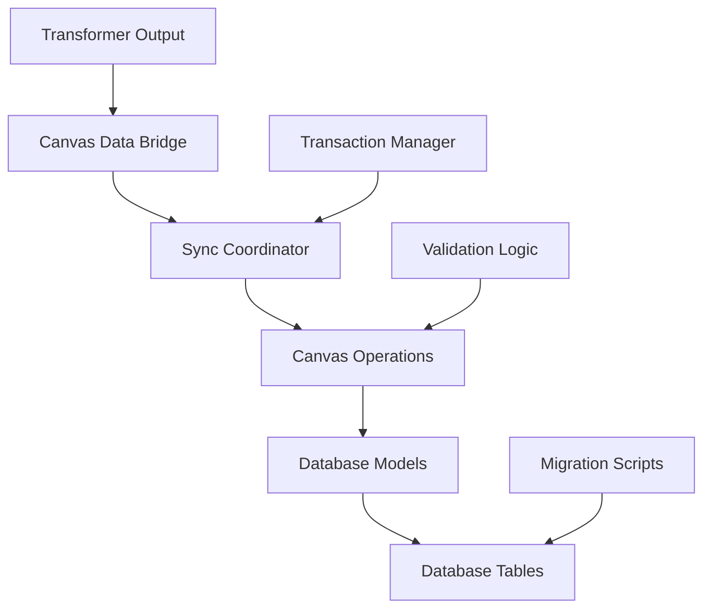

# Canvas Tracker V3: Database Field Management Guide

> **Complete guide for adding and removing fields in the database pipeline from transformer output to database tables**

## Overview

This guide covers field management in the database-side pipeline, from transformer output through to database storage. The database pipeline follows this flow:

```
Transformer Output → Canvas Bridge → Sync Coordinator → Canvas Operations → Database Models → Database Tables
```

## Table of Contents

1. [Database Pipeline Architecture](#database-pipeline-architecture)
2. [Adding New Fields](#adding-new-fields)
3. [Concrete Example: Adding Course `created_at`](#concrete-example-adding-course-created_at)
4. [Removing Fields](#removing-fields)
5. [Database Migrations](#database-migrations)
6. [Testing and Validation](#testing-and-validation)
7. [Advanced Field Types](#advanced-field-types)
8. [Troubleshooting](#troubleshooting)

## Database Pipeline Architecture

### Data Flow Overview



### Key Components by Stage

| Stage | Files | Purpose |
|-------|-------|---------|
| **Canvas Bridge** | `database/operations/canvas_bridge.py` | Orchestrates TypeScript → Database sync |
| **Sync Coordinator** | `database/operations/layer1/sync_coordinator.py` | Manages full sync operations with conflict resolution |
| **Canvas Operations** | `database/operations/layer1/canvas_ops.py` | CRUD operations with change detection |
| **Database Models** | `database/models/layer1_canvas.py` | SQLAlchemy model definitions |
| **Migration Scripts** | `database/migrations/versions/*.py` | Alembic database migrations |

### Data Processing Layers

1. **Canvas Bridge** - Receives transformer output and coordinates sync
2. **Sync Coordinator** - Handles transaction management and conflict resolution
3. **Canvas Operations** - Performs model-specific CRUD operations
4. **Database Models** - SQLAlchemy models with field definitions
5. **Database Tables** - Physical database storage

## Adding New Fields

### Step-by-Step Process

When adding a field that's already been added to the transformer output, follow these steps:

#### Step 1: Update Database Model

**File:** `database/models/layer1_canvas.py`

Add the field to the appropriate SQLAlchemy model:

```python
class CanvasCourse(CanvasEntityModel):
    __tablename__ = 'canvas_courses'
    
    # Existing fields...
    id = Column(Integer, primary_key=True)
    name = Column(String(255), nullable=False, default='')
    course_code = Column(String(100), nullable=True)
    
    # ADD NEW FIELD HERE
    created_at = Column(DateTime, nullable=True)
    
    # Canvas timestamps
    start_at = Column(DateTime, nullable=True)
    end_at = Column(DateTime, nullable=True)
```

#### Step 2: Update Canvas Operations (Create Method)

**File:** `database/operations/layer1/canvas_ops.py`

Update the `_create_course_from_data` method to handle the new field:

```python
def _create_course_from_data(self, canvas_data: Dict[str, Any]) -> CanvasCourse:
    """Create new CanvasCourse from Canvas API data."""
    # Parse Canvas timestamps
    created_at = datetime.now(timezone.utc)
    
    # ADD FIELD HANDLING HERE
    if canvas_data.get('created_at'):
        try:
            created_at_value = canvas_data['created_at']
            if isinstance(created_at_value, datetime):
                created_at = created_at_value
            else:
                created_at = datetime.fromisoformat(created_at_value.replace('Z', '+00:00'))
        except (ValueError, AttributeError):
            pass  # Use default
    
    return CanvasCourse(
        id=canvas_data['id'],
        name=canvas_data.get('name', ''),
        course_code=canvas_data.get('course_code', ''),
        # ADD FIELD ASSIGNMENT HERE
        created_at=created_at,
        calendar_ics=canvas_data.get('calendar_ics', ''),
        last_synced=datetime.now(timezone.utc)
    )
```

#### Step 3: Update Canvas Operations (Change Detection)

Update the `_course_needs_update` method to detect changes in the new field:

```python
def _course_needs_update(self, existing: CanvasCourse, canvas_data: Dict[str, Any]) -> bool:
    """Check if course data has changed and needs update."""
    
    # Parse new field value for comparison
    canvas_created_at = None
    if canvas_data.get('created_at'):
        try:
            created_at_value = canvas_data['created_at']
            if isinstance(created_at_value, datetime):
                canvas_created_at = created_at_value
            else:
                canvas_created_at = datetime.fromisoformat(created_at_value.replace('Z', '+00:00'))
        except (ValueError, AttributeError):
            canvas_created_at = None
    
    return (
        existing.name != canvas_data.get('name', existing.name) or
        existing.course_code != canvas_data.get('course_code', existing.course_code) or
        existing.calendar_ics != calendar_ics or
        # ADD FIELD COMPARISON HERE
        existing.created_at != canvas_created_at
    )
```

#### Step 4: Update Canvas Operations (Update Method)

Update the `_update_course_fields` method to handle field updates:

```python
def _update_course_fields(self, course: CanvasCourse, canvas_data: Dict[str, Any]) -> None:
    """Update existing course with new data."""
    if 'name' in canvas_data:
        course.name = canvas_data['name']
    if 'course_code' in canvas_data:
        course.course_code = canvas_data['course_code']
    
    # ADD FIELD UPDATE LOGIC HERE
    if 'created_at' in canvas_data:
        try:
            created_at_value = canvas_data['created_at']
            if isinstance(created_at_value, datetime):
                course.created_at = created_at_value
            else:
                course.created_at = datetime.fromisoformat(created_at_value.replace('Z', '+00:00'))
        except (ValueError, AttributeError):
            pass  # Keep existing value
    
    # Always update last_synced on sync
    course.last_synced = datetime.now(timezone.utc)
```

#### Step 5: Create Database Migration

```bash
# From database/ directory
alembic revision --autogenerate -m "Add created_at field to canvas_courses"
alembic upgrade head
```

## Concrete Example: Adding Course `created_at`

Let's walk through the complete process for adding `created_at` to course tracking:

### 1. Database Model Update

```python
# database/models/layer1_canvas.py
class CanvasCourse(CanvasEntityModel):
    __tablename__ = 'canvas_courses'
    
    # Canvas course ID as primary key
    id = Column(Integer, primary_key=True)
    
    # Basic course information
    course_code = Column(String(100), nullable=True)
    calendar_ics = Column(Text, nullable=True)
    
    # Canvas timestamps - NEW FIELD ADDED
    created_at = Column(DateTime, nullable=True)     # NEW FIELD
    start_at = Column(DateTime, nullable=True)       # Existing
    end_at = Column(DateTime, nullable=True)         # Existing
    
    # Course statistics
    total_students = Column(Float, nullable=True)
    # ... other fields
```

### 2. Canvas Operations - Create Method

```python
# database/operations/layer1/canvas_ops.py
def _create_course_from_data(self, canvas_data: Dict[str, Any]) -> CanvasCourse:
    """Create new CanvasCourse from Canvas API data."""
    # Parse Canvas timestamps
    created_at = datetime.now(timezone.utc)      # Default fallback
    updated_at = datetime.now(timezone.utc)
    
    # Handle created_at field from transformer output
    if canvas_data.get('created_at'):
        try:
            created_at_value = canvas_data['created_at']
            if isinstance(created_at_value, datetime):
                created_at = created_at_value
            else:
                created_at = datetime.fromisoformat(created_at_value.replace('Z', '+00:00'))
        except (ValueError, AttributeError):
            pass  # Use default fallback
            
    # Handle updated_at similarly
    if canvas_data.get('updated_at'):
        try:
            updated_at_value = canvas_data['updated_at']
            if isinstance(updated_at_value, datetime):
                updated_at = updated_at_value
            else:
                updated_at = datetime.fromisoformat(updated_at_value.replace('Z', '+00:00'))
        except (ValueError, AttributeError):
            updated_at = created_at  # Fallback to created_at
    
    return CanvasCourse(
        id=canvas_data['id'],
        name=canvas_data.get('name', ''),
        course_code=canvas_data.get('course_code', ''),
        calendar_ics=canvas_data.get('calendar_ics', ''),
        created_at=created_at,          # NEW FIELD
        start_at=self._parse_datetime(canvas_data.get('start_at')),
        end_at=self._parse_datetime(canvas_data.get('end_at')),
        updated_at=updated_at,
        last_synced=datetime.now(timezone.utc)
    )
```

### 3. Canvas Operations - Change Detection

```python
def _course_needs_update(self, existing: CanvasCourse, canvas_data: Dict[str, Any]) -> bool:
    """Check if course data has changed and needs update."""
    
    # Parse created_at for comparison
    canvas_created_at = None
    if canvas_data.get('created_at'):
        try:
            created_at_value = canvas_data['created_at']
            if isinstance(created_at_value, datetime):
                canvas_created_at = created_at_value
            else:
                canvas_created_at = datetime.fromisoformat(created_at_value.replace('Z', '+00:00'))
        except (ValueError, AttributeError):
            canvas_created_at = None

    # Extract calendar ICS for comparison
    calendar_ics = ''
    if canvas_data.get('calendar_ics'):
        calendar_ics = canvas_data['calendar_ics']
        
    return (
        existing.name != canvas_data.get('name', existing.name) or
        existing.course_code != canvas_data.get('course_code', existing.course_code) or
        existing.calendar_ics != calendar_ics or
        existing.created_at != canvas_created_at  # NEW COMPARISON
    )
```

### 4. Canvas Operations - Update Method

```python
def _update_course_fields(self, course: CanvasCourse, canvas_data: Dict[str, Any]) -> None:
    """Update existing course with new data."""
    if 'name' in canvas_data:
        course.name = canvas_data['name']
    if 'course_code' in canvas_data:
        course.course_code = canvas_data['course_code']
    if 'calendar_ics' in canvas_data:
        course.calendar_ics = canvas_data['calendar_ics']
    
    # Handle created_at field updates (usually shouldn't change)
    if 'created_at' in canvas_data:
        try:
            created_at_value = canvas_data['created_at']
            if isinstance(created_at_value, datetime):
                course.created_at = created_at_value
            else:
                course.created_at = datetime.fromisoformat(created_at_value.replace('Z', '+00:00'))
        except (ValueError, AttributeError):
            pass  # Keep existing value
    
    # Update timestamp from Canvas data
    if 'updated_at' in canvas_data:
        try:
            updated_at_value = canvas_data['updated_at']
            if isinstance(updated_at_value, datetime):
                course.updated_at = updated_at_value
            else:
                course.updated_at = datetime.fromisoformat(updated_at_value.replace('Z', '+00:00'))
        except (ValueError, AttributeError):
            course.updated_at = datetime.now(timezone.utc)
    
    # Always update last_synced on sync
    course.last_synced = datetime.now(timezone.utc)
```

### 5. Database Migration

```bash
# Generate migration
alembic revision --autogenerate -m "Add created_at timestamp to canvas_courses"

# Review the generated migration file
# Then apply it
alembic upgrade head
```

The migration file will look like:

```python
# migrations/versions/add_created_at_to_courses.py
def upgrade():
    op.add_column('canvas_courses', sa.Column('created_at', sa.DateTime(), nullable=True))

def downgrade():
    op.drop_column('canvas_courses', 'created_at')
```

## Removing Fields

### Step-by-Step Process

#### Step 1: Remove from Canvas Operations

**File:** `database/operations/layer1/canvas_ops.py`

Remove field handling from create, update, and change detection methods:

```python
def _create_course_from_data(self, canvas_data: Dict[str, Any]) -> CanvasCourse:
    return CanvasCourse(
        id=canvas_data['id'],
        name=canvas_data.get('name', ''),
        course_code=canvas_data.get('course_code', ''),
        # REMOVE THIS LINE
        # deprecated_field=canvas_data.get('deprecated_field'),
        last_synced=datetime.now(timezone.utc)
    )

def _course_needs_update(self, existing: CanvasCourse, canvas_data: Dict[str, Any]) -> bool:
    return (
        existing.name != canvas_data.get('name', existing.name) or
        existing.course_code != canvas_data.get('course_code', existing.course_code)
        # REMOVE THIS LINE
        # or existing.deprecated_field != canvas_data.get('deprecated_field')
    )

def _update_course_fields(self, course: CanvasCourse, canvas_data: Dict[str, Any]) -> None:
    if 'name' in canvas_data:
        course.name = canvas_data['name']
    # REMOVE THIS BLOCK
    # if 'deprecated_field' in canvas_data:
    #     course.deprecated_field = canvas_data['deprecated_field']
```

#### Step 2: Remove from Database Model

**File:** `database/models/layer1_canvas.py`

Remove the field definition:

```python
class CanvasCourse(CanvasEntityModel):
    __tablename__ = 'canvas_courses'
    
    id = Column(Integer, primary_key=True)
    name = Column(String(255), nullable=False, default='')
    course_code = Column(String(100), nullable=True)
    
    # REMOVE OR COMMENT OUT
    # deprecated_field = Column(String(255), nullable=True)
```

#### Step 3: Create Migration

```bash
alembic revision --autogenerate -m "Remove deprecated_field from canvas_courses"
alembic upgrade head
```

### Safe Removal Process

1. **Test without the field first** - Remove from operations but keep in model
2. **Run integration tests** - Ensure sync operations work
3. **Remove from database model** - Create migration to drop column
4. **Deploy and monitor** - Watch for any issues

## Database Migrations

### Creating Migrations

```bash
# Auto-generate migration based on model changes
alembic revision --autogenerate -m "Description of changes"

# Create empty migration for manual changes
alembic revision -m "Manual migration description"

# Apply migrations
alembic upgrade head

# Rollback migrations
alembic downgrade -1  # Go back one migration
alembic downgrade base  # Go back to beginning
```

### Migration Best Practices

#### 1. Always Review Generated Migrations

```python
# Generated migration - always review before applying
def upgrade():
    # Check that this matches your intent
    op.add_column('canvas_courses', sa.Column('created_at', sa.DateTime(), nullable=True))

def downgrade():
    # Ensure downgrade works correctly
    op.drop_column('canvas_courses', 'created_at')
```

#### 2. Handle Data Migrations

For complex changes, separate schema and data migrations:

```python
def upgrade():
    # Step 1: Add new column
    op.add_column('canvas_courses', sa.Column('formatted_code', sa.String(150), nullable=True))
    
    # Step 2: Populate data
    connection = op.get_bind()
    connection.execute("""
        UPDATE canvas_courses 
        SET formatted_code = UPPER(course_code) 
        WHERE course_code IS NOT NULL
    """)
    
    # Step 3: Make non-nullable if desired
    op.alter_column('canvas_courses', 'formatted_code', nullable=False)
```

#### 3. Test Migrations

```python
# Test both upgrade and downgrade
def test_migration():
    # Apply migration
    alembic upgrade head
    
    # Test data integrity
    # Test application functionality
    
    # Test rollback
    alembic downgrade -1
    
    # Verify rollback worked
```

## Testing and Validation

### 1. Unit Tests for Operations

```python
# database/tests/test_canvas_ops.py
def test_course_with_created_at():
    canvas_data = {
        'id': 12345,
        'name': 'Test Course',
        'course_code': 'TEST101',
        'created_at': '2024-01-01T10:00:00Z'  # NEW FIELD
    }
    
    manager = CanvasDataManager(session)
    course = manager.sync_course(canvas_data)
    
    assert course.id == 12345
    assert course.created_at is not None
    assert course.created_at.year == 2024
```

### 2. Integration Tests

```python
# database/tests/test_integration.py
def test_full_sync_with_new_field():
    transformer_output = {
        'courses': [{
            'id': 12345,
            'name': 'Test Course',
            'created_at': datetime(2024, 1, 1, tzinfo=timezone.utc)
        }]
    }
    
    coordinator = SyncCoordinator(session)
    result = coordinator.execute_full_sync(transformer_output)
    
    assert result.success
    assert result.objects_created['courses'] == 1
    
    # Verify field was saved
    course = session.query(CanvasCourse).filter_by(id=12345).first()
    assert course.created_at == datetime(2024, 1, 1, tzinfo=timezone.utc)
```

### 3. Validation Tests

```python
# Test field validation
def test_created_at_validation():
    # Test valid timestamp
    canvas_data = {'id': 1, 'created_at': '2024-01-01T10:00:00Z'}
    course = manager.sync_course(canvas_data)
    assert course.created_at is not None
    
    # Test invalid timestamp (should not crash)
    canvas_data = {'id': 2, 'created_at': 'invalid-date'}
    course = manager.sync_course(canvas_data)
    assert course.created_at is not None  # Should use fallback
    
    # Test missing timestamp
    canvas_data = {'id': 3}
    course = manager.sync_course(canvas_data)
    assert course.created_at is not None  # Should use default
```

### 4. Database Schema Tests

```python
def test_database_schema():
    """Test that database schema matches model definitions."""
    from sqlalchemy import inspect
    
    inspector = inspect(engine)
    columns = inspector.get_columns('canvas_courses')
    
    column_names = [col['name'] for col in columns]
    assert 'created_at' in column_names
    
    # Check column type
    created_at_col = next(col for col in columns if col['name'] == 'created_at')
    assert 'DATETIME' in str(created_at_col['type']).upper()
    assert created_at_col['nullable'] == True
```

### Running Tests

```bash
# Run specific test files
pytest database/tests/test_canvas_ops.py -v
pytest database/tests/test_integration.py -v

# Run all database tests
pytest database/tests/ -v

# Run tests with coverage
pytest database/tests/ --cov=database/operations --cov-report=html
```

## Advanced Field Types

### 1. JSON Fields

For complex nested data:

```python
# Database model
from sqlalchemy.dialects.postgresql import JSON
from sqlalchemy import JSON as GenericJSON

class CanvasCourse(CanvasEntityModel):
    # Use JSON field for complex data
    metadata_json = Column(JSON, nullable=True)  # PostgreSQL
    # or
    metadata_json = Column(GenericJSON, nullable=True)  # Cross-database

# Canvas operations
def _create_course_from_data(self, canvas_data: Dict[str, Any]) -> CanvasCourse:
    import json
    
    metadata = {}
    if canvas_data.get('custom_fields'):
        metadata = canvas_data['custom_fields']
    
    return CanvasCourse(
        id=canvas_data['id'],
        metadata_json=metadata if metadata else None
    )
```

### 2. Enum Fields

For controlled vocabulary:

```python
from enum import Enum
from sqlalchemy import Enum as SQLEnum

class CourseStatus(Enum):
    ACTIVE = "active"
    INACTIVE = "inactive"
    ARCHIVED = "archived"

class CanvasCourse(CanvasEntityModel):
    status = Column(SQLEnum(CourseStatus), default=CourseStatus.ACTIVE)

# Canvas operations
def _create_course_from_data(self, canvas_data: Dict[str, Any]) -> CanvasCourse:
    status = CourseStatus.ACTIVE  # default
    if canvas_data.get('workflow_state'):
        state_mapping = {
            'available': CourseStatus.ACTIVE,
            'unpublished': CourseStatus.INACTIVE,
            'completed': CourseStatus.ARCHIVED
        }
        status = state_mapping.get(canvas_data['workflow_state'], CourseStatus.ACTIVE)
    
    return CanvasCourse(
        id=canvas_data['id'],
        status=status
    )
```

### 3. Relationship Fields

For related data:

```python
# Database models
class CanvasCourse(CanvasEntityModel):
    # One-to-many relationship
    assignments = relationship("CanvasAssignment", back_populates="course")
    
class CanvasAssignment(CanvasEntityModel):
    course_id = Column(Integer, ForeignKey('canvas_courses.id'))
    course = relationship("CanvasCourse", back_populates="assignments")

# Canvas operations - relationships are handled automatically
# Just ensure foreign keys are populated correctly
def _create_assignment_from_data(self, canvas_data: Dict[str, Any], course_id: int):
    return CanvasAssignment(
        id=canvas_data['id'],
        course_id=course_id,  # Ensure foreign key is set
        name=canvas_data.get('name', '')
    )
```

## Troubleshooting

### Common Issues and Solutions

#### 1. "Column doesn't exist" Error

```
sqlalchemy.exc.OperationalError: (sqlite3.OperationalError) no such column: canvas_courses.created_at
```

**Solution:**
```bash
# Check migration status
alembic current
alembic history

# Apply missing migrations
alembic upgrade head

# If migration doesn't exist, create it
alembic revision --autogenerate -m "Add missing created_at field"
```

#### 2. "Invalid datetime format" Error

```
ValueError: Invalid isoformat string: 'invalid-date'
```

**Solution:**
```python
def _parse_datetime_safely(self, date_string):
    """Safe datetime parsing with fallback."""
    if not date_string:
        return None
    
    try:
        if isinstance(date_string, datetime):
            return date_string
        return datetime.fromisoformat(date_string.replace('Z', '+00:00'))
    except (ValueError, AttributeError) as e:
        self.logger.warning(f"Failed to parse datetime '{date_string}': {e}")
        return None  # or datetime.now(timezone.utc) for required fields
```

#### 3. "Foreign key constraint failed" Error

```
sqlite3.IntegrityError: FOREIGN KEY constraint failed
```

**Solution:**
```python
# Ensure parent records exist before creating children
def sync_assignment(self, canvas_data: Dict[str, Any], course_id: int):
    # Verify course exists first
    course = self.session.query(CanvasCourse).filter_by(id=course_id).first()
    if not course:
        raise CanvasOperationError(f"Cannot create assignment: course {course_id} not found")
    
    # Now create assignment
    return self._create_assignment_from_data(canvas_data, course_id)
```

#### 4. "Transaction rollback" Error

```
sqlalchemy.exc.InvalidRequestError: This Session's transaction has been rolled back
```

**Solution:**
```python
# Use transaction management
from database.operations.base.transaction_manager import TransactionManager

def sync_with_transaction(self, canvas_data):
    transaction_manager = TransactionManager(self.session)
    
    try:
        with transaction_manager.begin_nested_transaction():
            # Perform operations
            self._sync_courses(canvas_data['courses'])
            self._sync_students(canvas_data['students'])
            # Transaction commits automatically if successful
    except Exception as e:
        # Transaction rolls back automatically on exception
        self.logger.error(f"Sync failed: {e}")
        raise
```

### Debugging Tools

#### 1. SQL Query Logging

```python
# Enable SQL logging
import logging
logging.getLogger('sqlalchemy.engine').setLevel(logging.INFO)

# Or in your operations
def debug_query(self, model_class, filters=None):
    query = self.session.query(model_class)
    if filters:
        query = query.filter_by(**filters)
    
    # Print the SQL
    print("SQL Query:", str(query))
    
    return query.all()
```

#### 2. Model Inspection

```python
def inspect_model_changes(self, instance):
    """Debug what fields changed on a model instance."""
    from sqlalchemy import inspect
    
    inspector = inspect(instance)
    
    print("Dirty fields:", inspector.attrs.keys())
    for attr in inspector.attrs:
        hist = inspector.attrs[attr].history
        if hist.has_changes():
            print(f"  {attr}: {hist.deleted} -> {hist.added}")
```

#### 3. Transaction State Checking

```python
def check_transaction_state(self):
    """Debug current transaction state."""
    print(f"Transaction active: {self.session.is_active}")
    print(f"Session dirty: {len(self.session.dirty)}")
    print(f"Session new: {len(self.session.new)}")
    print(f"Session deleted: {len(self.session.deleted)}")
```

## Best Practices

### 1. Field Naming Convention

- Use snake_case for database fields
- Match Canvas API field names when possible
- Use descriptive names for calculated fields

```python
# Good
created_at = Column(DateTime, nullable=True)           # Matches Canvas
enrollment_status = Column(String(50), nullable=True)  # Descriptive
last_synced = Column(DateTime, nullable=False)         # Clear purpose

# Avoid
dt_created = Column(DateTime, nullable=True)           # Cryptic
status = Column(String(50), nullable=True)             # Too generic
```

### 2. Default Values and Nullability

- Make new fields nullable initially
- Provide sensible defaults in application code
- Consider database-level defaults for required fields

```python
# Good approach
created_at = Column(DateTime, nullable=True)  # Nullable for existing records

def _create_course_from_data(self, canvas_data):
    return CanvasCourse(
        created_at=canvas_data.get('created_at') or datetime.now(timezone.utc)
    )

# With database default
last_synced = Column(DateTime, nullable=False, default=datetime.now)
```

### 3. Change Detection Optimization

- Only check fields that can actually change
- Use efficient comparison methods
- Consider change significance

```python
def _course_needs_update(self, existing: CanvasCourse, canvas_data: Dict[str, Any]) -> bool:
    # Skip fields that rarely change
    if existing.created_at and not canvas_data.get('created_at'):
        # Don't update if we have created_at but Canvas doesn't provide it
        pass
    
    # Focus on fields that change frequently
    return (
        existing.name != canvas_data.get('name', existing.name) or
        existing.current_score != canvas_data.get('current_score', existing.current_score)
    )
```

### 4. Error Handling

- Always handle datetime parsing errors
- Provide meaningful error messages
- Use fallback values appropriately

```python
def _safe_datetime_parse(self, value, field_name="datetime"):
    """Safely parse datetime with detailed error handling."""
    if not value:
        return None
    
    try:
        if isinstance(value, datetime):
            return value
        return datetime.fromisoformat(value.replace('Z', '+00:00'))
    except (ValueError, AttributeError) as e:
        self.logger.warning(
            f"Failed to parse {field_name} '{value}': {e}. Using None."
        )
        return None
```

---

**Need Help?**

- Check existing field implementations in the codebase
- Review test files for examples: `database/tests/test_canvas_ops.py`
- Use integration tests to validate full pipeline: `database/tests/test_integration.py`
- Test changes with small datasets first using the Canvas bridge