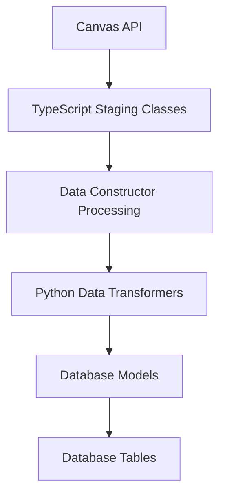

# Canvas Tracker V3: Field Management Guide

> **Complete guide for adding and removing fields throughout the Canvas API to database pipeline**

## Overview

This guide provides comprehensive instructions for adding and removing data fields in Canvas Tracker V3's data pipeline. The system follows a 5-stage flow:

```
Canvas API → TypeScript Staging → Data Constructor → Python Transformer → Database Models
```

## Table of Contents

1. [Pipeline Architecture](#pipeline-architecture)
2. [Adding New Fields](#adding-new-fields)
3. [Concrete Example: Adding Course `created_at`](#concrete-example-adding-course-created_at)
4. [Removing Fields](#removing-fields)
5. [Testing Your Changes](#testing-your-changes)
6. [Common Gotchas](#common-gotchas)
7. [Troubleshooting](#troubleshooting)

## Pipeline Architecture

### Data Flow Overview



### Key Files by Stage

| Stage | Files | Purpose |
|-------|-------|---------|
| **TypeScript Staging** | `canvas-interface/staging/canvas-staging-data.ts` | Raw Canvas API data structures |
| **Data Constructor** | `canvas-interface/staging/canvas-data-constructor.ts` | API calls and field filtering |
| **Python Transformer** | `database/operations/data_transformers.py` | Format conversion and validation |
| **Database Models** | `database/models/layer1_canvas.py` | SQLAlchemy table definitions |

## Adding New Fields

### Step-by-Step Process

#### Step 1: Update TypeScript Staging Classes

**File:** `canvas-interface/staging/canvas-staging-data.ts`

Add the new field to the appropriate staging class:

```typescript
export class CanvasCourseStaging {
  // Existing fields...
  id: number;
  name: string;
  course_code: string;
  
  // ADD NEW FIELD HERE
  created_at?: string;  // Canvas timestamp field
  
  constructor(data: any) {
    // Existing assignments...
    this.id = data.id;
    this.name = data.name;
    this.course_code = data.course_code;
    
    // ADD FIELD ASSIGNMENT HERE
    this.created_at = data.created_at;
  }
}
```

#### Step 2: Verify Canvas API Provides the Field

**File:** `src/infrastructure/http/canvas/CanvasTypes.ts`

Ensure the Canvas API type definition includes your field:

```typescript
export interface CanvasCourse {
  id: number;
  name: string;
  course_code: string;
  
  // ADD YOUR FIELD HERE IF NOT PRESENT
  created_at?: string;
}
```

#### Step 3: Update Data Constructor (if needed)

**File:** `canvas-interface/staging/canvas-data-constructor.ts`

Most fields are passed through automatically, but check if any special handling is needed:

```typescript
// In getCourseData method
const courseData = {
  id: courseInfo.id,
  name: courseInfo.name,
  course_code: courseInfo.course_code,
  // ADD IF SPECIAL PROCESSING NEEDED
  created_at: courseInfo.created_at,  // Usually automatic
  // ... other fields
};
```

#### Step 4: Update Python Data Transformer

**File:** `database/operations/data_transformers.py`

Add field handling in the appropriate transform method:

```python
def transform_course_data(self, course_data: Dict[str, Any]) -> List[Dict[str, Any]]:
    # ... existing code ...
    
    transformed_course = {
        'id': course_data['id'],
        'name': course_data.get('name', ''),
        'course_code': course_data.get('course_code', ''),
        
        # ADD NEW FIELD TRANSFORMATION HERE
        'created_at': self._parse_canvas_datetime(course_data.get('created_at')),
        
        # ... other fields ...
        'last_synced': datetime.now(timezone.utc)
    }
```

#### Step 5: Update Database Model

**File:** `database/models/layer1_canvas.py`

Add the field to the SQLAlchemy model:

```python
class CanvasCourse(CanvasEntityModel):
    __tablename__ = 'canvas_courses'
    
    # Existing fields...
    id = Column(Integer, primary_key=True)
    name = Column(String(255), nullable=False, default='')
    course_code = Column(String(100), nullable=True)
    
    # ADD NEW FIELD HERE
    created_at = Column(DateTime, nullable=True)
```

#### Step 6: Create Database Migration

```bash
# From database/ directory
alembic revision --autogenerate -m "Add created_at field to canvas_courses"
alembic upgrade head
```

## Concrete Example: Adding Course `created_at`

Let's walk through adding the `created_at` timestamp to course tracking:

### 1. TypeScript Staging Class

```typescript
// canvas-interface/staging/canvas-staging-data.ts
export class CanvasCourseStaging {
  id: number;
  name: string;
  course_code: string;
  created_at?: string;  // NEW FIELD
  workflow_state?: string;
  start_at?: string;
  end_at?: string;
  
  constructor(data: any) {
    this.id = data.id;
    this.name = data.name;
    this.course_code = data.course_code;
    this.created_at = data.created_at;  // NEW ASSIGNMENT
    this.workflow_state = data.workflow_state;
    this.start_at = data.start_at;
    this.end_at = data.end_at;
    // ... calendar and other fields
  }
}
```

### 2. Canvas API Types (Already Present)

```typescript
// src/infrastructure/http/canvas/CanvasTypes.ts
export interface CanvasCourse {
  id: number;
  name: string;
  course_code: string;
  workflow_state: 'unpublished' | 'available' | 'completed' | 'deleted';
  created_at?: string;  // ALREADY PRESENT ✓
  start_at: string | null;
  end_at: string | null;
}
```

### 3. Data Constructor (Automatic)

```typescript
// canvas-interface/staging/canvas-data-constructor.ts
// In getCourseData method - field passed through automatically
const courseData = {
  id: courseInfo.id,
  name: courseInfo.name,
  course_code: courseInfo.course_code,
  workflow_state: courseInfo.workflow_state,
  start_at: courseInfo.start_at,
  end_at: courseInfo.end_at,
  created_at: courseInfo.created_at,  // AUTOMATICALLY INCLUDED ✓
  calendar: { ics: null }
};
```

### 4. Python Transformer Update

```python
# database/operations/data_transformers.py
def transform_course_data(self, course_data: Dict[str, Any]) -> List[Dict[str, Any]]:
    # ... validation code ...
    
    transformed_course = {
        'id': course_data['id'],
        'name': course_data.get('name', ''),
        'course_code': course_data.get('course_code', ''),
        'calendar_ics': self._extract_calendar_ics(course_data),
        'workflow_state': course_data.get('workflow_state', 'available'),
        'created_at': self._parse_canvas_datetime(course_data.get('created_at')),  # NEW LINE
        'start_at': self._parse_canvas_datetime(course_data.get('start_at')),
        'end_at': self._parse_canvas_datetime(course_data.get('end_at')),
        'last_synced': datetime.now(timezone.utc)
    }
    # ... metadata handling ...
```

### 5. Database Model Update

```python
# database/models/layer1_canvas.py
class CanvasCourse(CanvasEntityModel):
    __tablename__ = 'canvas_courses'
    
    # Canvas course ID as primary key
    id = Column(Integer, primary_key=True)
    
    # Basic course information
    course_code = Column(String(100), nullable=True)
    calendar_ics = Column(Text, nullable=True)
    
    # Canvas timestamps - ADD THE NEW FIELD HERE
    created_at = Column(DateTime, nullable=True)     # NEW FIELD
    start_at = Column(DateTime, nullable=True)       # Existing
    end_at = Column(DateTime, nullable=True)         # Existing
    
    # Course statistics
    total_students = Column(Float, nullable=True)
    # ... rest of fields
```

### 6. Database Migration

```bash
# Generate migration
alembic revision --autogenerate -m "Add created_at field to canvas_courses table"

# Apply migration
alembic upgrade head
```

## Removing Fields

### Step-by-Step Process

#### Step 1: Remove from Database Model

**File:** `database/models/layer1_canvas.py`

Comment out or remove the field:

```python
class CanvasCourse(CanvasEntityModel):
    # ... other fields ...
    
    # REMOVE OR COMMENT OUT
    # deprecated_field = Column(String(255), nullable=True)
```

#### Step 2: Remove from Python Transformer

**File:** `database/operations/data_transformers.py`

Remove field from transformation logic:

```python
def transform_course_data(self, course_data: Dict[str, Any]) -> List[Dict[str, Any]]:
    transformed_course = {
        'id': course_data['id'],
        'name': course_data.get('name', ''),
        # REMOVE THIS LINE
        # 'deprecated_field': course_data.get('deprecated_field'),
    }
```

#### Step 3: Remove from TypeScript Staging

**File:** `canvas-interface/staging/canvas-staging-data.ts`

Remove field from class:

```typescript
export class CanvasCourseStaging {
  id: number;
  name: string;
  // REMOVE THIS FIELD
  // deprecated_field?: string;
  
  constructor(data: any) {
    this.id = data.id;
    this.name = data.name;
    // REMOVE THIS ASSIGNMENT
    // this.deprecated_field = data.deprecated_field;
  }
}
```

#### Step 4: Create Database Migration

```bash
alembic revision --autogenerate -m "Remove deprecated_field from canvas_courses"
alembic upgrade head
```

### Safe Removal Process

1. **Test without the field first** - Comment out transformer usage before removing from database
2. **Run full pipeline test** - Ensure no errors occur
3. **Remove from database model** - Create migration to drop column
4. **Clean up TypeScript** - Remove from staging classes last

## Testing Your Changes

### 1. TypeScript Tests

```bash
cd canvas-interface
npm test
```

### 2. Python Database Tests

```bash
cd database
pytest tests/test_data_transformers.py -v
```

### 3. Full Pipeline Test

```bash
cd database/tests
python test_real_canvas_api_pipeline.py
```

### 4. Integration Test

```bash
python test-environment/test_canvas_integration.py
```

## Common Gotchas

### 1. Field Naming Inconsistencies

**Problem:** Canvas API uses `created_at`, but you name it `creation_date` in your model

**Solution:** Use consistent naming or handle mapping in transformer:

```python
# In transformer - handle name mapping
'creation_date': self._parse_canvas_datetime(course_data.get('created_at')),
```

### 2. Nullable vs Non-Nullable Fields

**Problem:** Canvas sometimes doesn't provide optional fields

**Solution:** Always make new fields nullable and provide defaults:

```python
# Database model
created_at = Column(DateTime, nullable=True)  # ✓ Good

# Transformer with fallback
'created_at': self._parse_canvas_datetime(course_data.get('created_at')) or datetime.now(timezone.utc),
```

### 3. Timezone Handling

**Problem:** Canvas timestamps come in different formats

**Solution:** Always use the transformer's `_parse_canvas_datetime` method:

```python
# ✓ Correct - handles timezones properly
'created_at': self._parse_canvas_datetime(course_data.get('created_at')),

# ❌ Wrong - doesn't handle timezones
'created_at': datetime.fromisoformat(course_data.get('created_at')),
```

### 4. Configuration-Driven Fields

**Problem:** Some fields are only available with specific Canvas API configurations

**Solution:** Check sync configuration in data constructor:

```typescript
// In canvas-data-constructor.ts
if (this.config.courseFields.timestamps) {
  filteredCourse.created_at = courseData.created_at;
}
```

### 5. Migration Dependencies

**Problem:** Database migration fails due to field dependencies

**Solution:** Check for foreign keys, indexes, or constraints:

```bash
# Check current schema
alembic current
alembic history

# Create careful migration
alembic revision -m "Add field with proper constraints"
```

## Advanced Field Types

### Complex Object Fields

For nested Canvas API objects:

```typescript
// TypeScript staging
calendar: {
  ics: string;
};

// Constructor
this.calendar = {
  ics: data.calendar?.ics || ''
};
```

```python
# Python transformer
def _extract_calendar_ics(self, course_data: Dict[str, Any]) -> str:
    calendar = course_data.get('calendar')
    if isinstance(calendar, dict):
        return calendar.get('ics', '')
    return ''

# Usage
'calendar_ics': self._extract_calendar_ics(course_data),
```

### Array Fields

For Canvas API arrays (like enrollment types):

```python
# Database model - store as JSON or separate table
enrollment_types = Column(JSON, nullable=True)

# Transformer
'enrollment_types': json.dumps(course_data.get('enrollment_types', [])),
```

## Troubleshooting

### Common Error Messages

#### "Column doesn't exist"

```
sqlalchemy.exc.OperationalError: (sqlite3.OperationalError) no such column: canvas_courses.created_at
```

**Solution:** Run database migration:

```bash
alembic upgrade head
```

#### "Key error in transformer"

```
KeyError: 'created_at'
```

**Solution:** Use `.get()` method with default:

```python
'created_at': course_data.get('created_at'),  # Returns None if missing
```

#### "TypeScript compilation error"

```
Property 'created_at' does not exist on type
```

**Solution:** Add field to TypeScript interface:

```typescript
created_at?: string;  // Make optional if Canvas doesn't always provide it
```

### Debugging Pipeline Issues

1. **Enable debug logging** in transformer:

```python
# In data_transformers.py constructor
logging.basicConfig(level=logging.DEBUG)
```

2. **Check field values at each stage**:

```python
# Add debug prints in transformer
self.logger.debug(f"Course data keys: {course_data.keys()}")
self.logger.debug(f"created_at value: {course_data.get('created_at')}")
```

3. **Test with small dataset**:

```bash
# Use single course for testing
python test-environment/test_canvas_integration.py --course-id 12345
```

## Best Practices

### 1. Field Naming Convention

- Use Canvas API field names in TypeScript staging
- Use snake_case in Python and database
- Be consistent within each layer

### 2. Data Validation

Always validate new fields in the transformer:

```python
def _validate_course_created_at(self, created_at: Optional[datetime]) -> Optional[datetime]:
    """Validate course creation timestamp."""
    if created_at and created_at > datetime.now(timezone.utc):
        self.logger.warning(f"Course creation date in future: {created_at}")
        return None
    return created_at
```

### 3. Documentation

Update relevant documentation:

- Model docstrings
- API documentation
- Field mappings in comments

### 4. Backwards Compatibility

When removing fields:

1. Mark as deprecated first
2. Remove from new syncs
3. Drop from database after data cleanup

---

**Need Help?** 

- Check existing tests in `database/tests/test_data_transformers.py`
- Review similar field implementations in the codebase
- Test changes with small datasets first