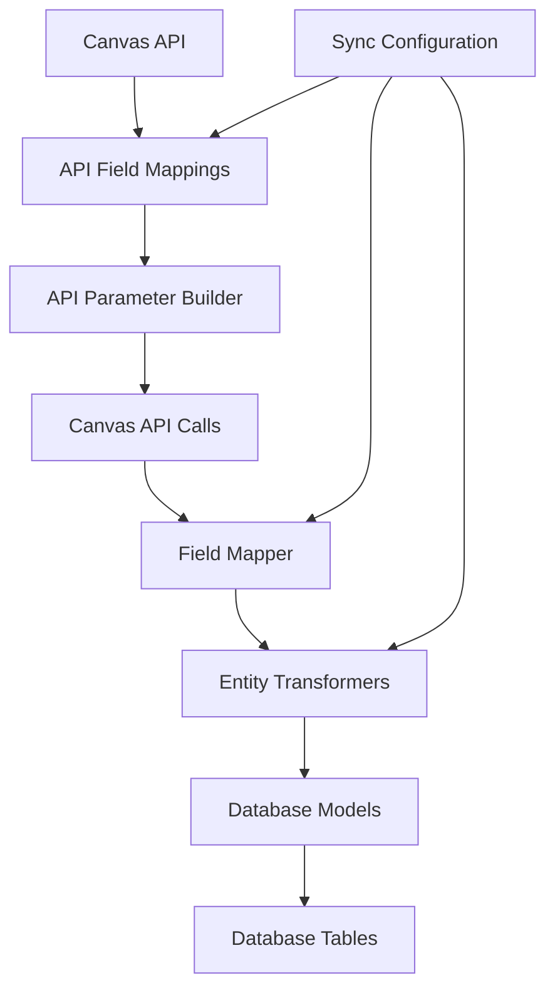

# Canvas Tracker V3: Field Management Guide

> **Complete guide for adding and removing fields in the configuration-driven Canvas API pipeline**

## Overview

This guide covers field management in Canvas Tracker V3's current implementation. The system includes comprehensive Canvas integration with data transformation:

```
Canvas API → Canvas Interface → Pipeline Orchestrator → Entity Transformers → Database Models
```

### Current Architecture
- **Canvas Interface** with staging data classes and API orchestration
- **Pipeline Orchestrator** for complete Canvas-to-Database processing
- **Production sync pipeline** with callable sync functions
- **Modular entity transformers** for Canvas data processing

## Table of Contents

1. [Pipeline Architecture](#pipeline-architecture)
2. [Adding New Fields](#adding-new-fields)
3. [Concrete Example: Adding Course `created_at`](#concrete-example-adding-course-created_at)
4. [Removing Fields](#removing-fields)
5. [Testing Your Changes](#testing-your-changes)
6. [Common Gotchas](#common-gotchas)
7. [Troubleshooting](#troubleshooting)

## Modern Pipeline Architecture

### Data Flow Overview



### Key Components by Stage

| Stage | Files | Purpose |
|-------|-------|---------|
| **API Field Mappings** | `canvas-interface/config/api-field-mappings.ts` | Configuration-to-parameter mappings |
| **API Parameter Builder** | `canvas-interface/utils/api-param-builder.ts` | Dynamic API parameter generation |
| **Field Mapper** | `canvas-interface/utils/field-mapper.ts` | Automatic type-safe field mapping |
| **Field Interfaces** | `canvas-interface/types/field-mappings.ts` | TypeScript interface definitions |
| **Entity Transformers** | `database/operations/transformers/*.py` | Modular transformation by entity type |
| **Database Models** | `database/models/layer1_canvas.py` | SQLAlchemy table definitions |

## Adding New Fields

### Current Field Addition Process

**Note**: Use the Pipeline Orchestrator (`canvas-interface/orchestration/pipeline-orchestrator.ts`) and production sync scripts (`call_canvas_sync.py`) to test field additions end-to-end.

The current architecture provides a straightforward process for adding fields. Here's the current workflow:

#### Step 1: Add Field to API Mapping Configuration

**File:** `canvas-interface/config/api-field-mappings.ts`

Add a mapping entry to request the field from Canvas API:

```typescript
export const COURSE_API_MAPPINGS: ApiFieldMapping[] = [
  // ... existing mappings ...
  
  // ADD NEW FIELD MAPPING
  {
    apiParam: 'created_at',
    configPath: 'courseFields.timestamps',
    description: 'Include course creation timestamp'
  }
];
```

#### Step 2: Add Field to TypeScript Interface

**File:** `canvas-interface/types/field-mappings.ts`

Add the field to the appropriate interface:

```typescript
export interface CanvasCourseFields {
  // Required fields
  id: number;
  name: string;
  course_code: string;
  
  // ADD NEW FIELD HERE
  created_at?: string;  // Canvas timestamp field
  
  // ... other optional fields
}
```

#### Step 3: Update Entity Transformer

**File:** `database/operations/transformers/courses.py`

Add field handling to the transformer's optional fields and transform logic:

```python
class CourseTransformer(EntityTransformer):
    @property
    def optional_fields(self) -> Set[str]:
        return {
            'workflow_state',
            'start_at',
            'end_at',
            # ADD NEW FIELD HERE
            'created_at',
            # ... other fields
        }
    
    def transform_entity(self, entity_data: Dict[str, Any], context: TransformationContext) -> Optional[Dict[str, Any]]:
        # ... existing transform logic ...
        
        # ADD FIELD TRANSFORMATION
        self._add_optional_field(entity_data, transformed_course, 'created_at', self._parse_canvas_datetime)
```

#### Step 4: Update Database Model (if needed)

**File:** `database/models/layer1_canvas.py`

Add the field to the SQLAlchemy model:

```python
class CanvasCourse(CanvasEntityModel):
    __tablename__ = 'canvas_courses'
    
    # Existing fields...
    id = Column(Integer, primary_key=True)
    name = Column(String(255), nullable=False, default='')
    course_code = Column(String(100), nullable=True)
    
    # ADD NEW FIELD HERE
    created_at = Column(DateTime, nullable=True)
```

#### Step 5: Create Database Migration

```bash
# From database/ directory
alembic revision --autogenerate -m "Add created_at field to canvas_courses"
alembic upgrade head
```

### Benefits of the New Architecture

- **Configuration-driven**: API parameters are built automatically based on sync configuration
- **Type-safe**: Field interfaces ensure compile-time validation
- **Automatic mapping**: `FieldMapper` handles field extraction automatically  
- **Modular transformers**: Easy to extend with new entity types
- **No manual staging classes**: Eliminates 200+ lines of manual field assignments

## Concrete Example: Adding Course `created_at`

Let's walk through adding the `created_at` timestamp to course tracking using the new configuration-driven approach:

### 1. Add API Field Mapping

```typescript
// canvas-interface/config/api-field-mappings.ts
export const COURSE_API_MAPPINGS: ApiFieldMapping[] = [
  // ... existing mappings ...
  {
    apiParam: 'syllabus_body',
    configPath: 'courseFields.extended',
    description: 'Include course syllabus content'
  },
  // ADD THIS NEW MAPPING
  {
    apiParam: 'created_at',
    configPath: 'courseFields.timestamps', 
    description: 'Include course creation timestamp'
  }
];
```

### 2. Add Field to TypeScript Interface

```typescript
// canvas-interface/types/field-mappings.ts
export interface CanvasCourseFields {
  // Required fields
  id: number;
  name: string;
  course_code: string;
  
  // Optional timestamp fields - ADD NEW FIELD HERE
  created_at?: string;  // NEW FIELD
  start_at?: string;
  end_at?: string;
  
  // ... other optional fields
}
```

### 3. Field Mapping (Automatic)

The `FieldMapper` utility automatically maps fields from Canvas API responses to the interface:

```typescript
// canvas-interface/utils/field-mapper.ts
// This happens automatically - no manual code needed!
const courseData = FieldMapper.mapCanvasCourseAdvanced(canvasResponse, fieldConfig);
// Result: { id: 123, name: 'Course', created_at: '2024-01-01T00:00:00Z', ... }
```

### 4. Update Entity Transformer

```python
# database/operations/transformers/courses.py
class CourseTransformer(EntityTransformer):
    @property
    def optional_fields(self) -> Set[str]:
        return {
            'workflow_state',
            'start_at',
            'end_at',
            'created_at',  # ADD NEW FIELD HERE
            # ... other fields
        }
    
    def transform_entity(self, entity_data: Dict[str, Any], context: TransformationContext):
        # Build base transformed course
        transformed_course = {
            'id': int(entity_data['id']),
            'name': entity_data.get('name', ''),
            'course_code': entity_data.get('course_code', ''),
            'workflow_state': entity_data.get('workflow_state', 'available'),
            'last_synced': datetime.now(timezone.utc)
        }
        
        # ADD FIELD TRANSFORMATION - uses helper method
        self._add_optional_field(entity_data, transformed_course, 'created_at', self._parse_canvas_datetime)
        self._add_optional_field(entity_data, transformed_course, 'start_at', self._parse_canvas_datetime)
        self._add_optional_field(entity_data, transformed_course, 'end_at', self._parse_canvas_datetime)
        
        return transformed_course
```

### 5. Database Model Update

```python
# database/models/layer1_canvas.py
class CanvasCourse(CanvasEntityModel):
    __tablename__ = 'canvas_courses'
    
    # Canvas course ID as primary key
    id = Column(Integer, primary_key=True)
    
    # Basic course information
    course_code = Column(String(100), nullable=True)
    calendar_ics = Column(Text, nullable=True)
    
    # Canvas timestamps - ADD THE NEW FIELD HERE
    created_at = Column(DateTime, nullable=True)     # NEW FIELD
    start_at = Column(DateTime, nullable=True)       # Existing
    end_at = Column(DateTime, nullable=True)         # Existing
    
    # Course statistics
    total_students = Column(Float, nullable=True)
    # ... rest of fields
```

### 6. Database Migration

```bash
# Generate migration
alembic revision --autogenerate -m "Add created_at field to canvas_courses table"

# Apply migration
alembic upgrade head
```

## Removing Fields

### Modern Step-by-Step Process

#### Step 1: Remove from API Field Mappings

**File:** `canvas-interface/config/api-field-mappings.ts`

Remove or comment out the mapping entry:

```typescript
export const COURSE_API_MAPPINGS: ApiFieldMapping[] = [
  // ... other mappings ...
  
  // REMOVE OR COMMENT OUT THIS MAPPING
  // {
  //   apiParam: 'deprecated_field',
  //   configPath: 'courseFields.deprecated',
  //   description: 'Include deprecated field'
  // }
];
```

#### Step 2: Remove from TypeScript Interface

**File:** `canvas-interface/types/field-mappings.ts`

Remove the field from the interface:

```typescript
export interface CanvasCourseFields {
  id: number;
  name: string;
  course_code: string;
  
  // REMOVE THIS FIELD
  // deprecated_field?: string;
}
```

#### Step 3: Remove from Entity Transformer

**File:** `database/operations/transformers/courses.py`

Remove field from optional_fields and any transformation logic:

```python
class CourseTransformer(EntityTransformer):
    @property
    def optional_fields(self) -> Set[str]:
        return {
            'workflow_state',
            'start_at',
            'end_at',
            # REMOVE THIS FIELD
            # 'deprecated_field',
        }
    
    def transform_entity(self, entity_data, context):
        # ... existing logic ...
        
        # REMOVE ANY TRANSFORMATION CALLS
        # self._add_optional_field(entity_data, transformed_course, 'deprecated_field')
```

#### Step 4: Remove from Database Model

**File:** `database/models/layer1_canvas.py`

Remove the field definition:

```python
class CanvasCourse(CanvasEntityModel):
    # ... other fields ...
    
    # REMOVE OR COMMENT OUT
    # deprecated_field = Column(String(255), nullable=True)
```

#### Step 5: Create Database Migration

```bash
alembic revision --autogenerate -m "Remove deprecated_field from canvas_courses"
alembic upgrade head
```

### Safe Removal Process

1. **Test without the field first** - Comment out transformer usage before removing from database
2. **Run full pipeline test** - Ensure no errors occur
3. **Remove from database model** - Create migration to drop column
4. **Clean up TypeScript** - Remove from staging classes last

## Testing Your Changes

### 1. TypeScript Tests

```bash
cd canvas-interface
npm test
```

### 2. Python Database Tests

```bash
cd database
pytest tests/test_data_transformers.py -v
```

### 3. Full Pipeline Test

```bash
cd database/tests
python test_real_canvas_api_pipeline.py
```

### 4. Integration Test

```bash
python test-environment/test_canvas_integration.py
```

## Common Gotchas

### 1. Field Naming Inconsistencies

**Problem:** Canvas API uses `created_at`, but you name it `creation_date` in your model

**Solution:** Use consistent naming or handle mapping in transformer:

```python
# In transformer - handle name mapping
'creation_date': self._parse_canvas_datetime(course_data.get('created_at')),
```

### 2. Nullable vs Non-Nullable Fields

**Problem:** Canvas sometimes doesn't provide optional fields

**Solution:** Always make new fields nullable and provide defaults:

```python
# Database model
created_at = Column(DateTime, nullable=True)  # ✓ Good

# Transformer with fallback
'created_at': self._parse_canvas_datetime(course_data.get('created_at')) or datetime.now(timezone.utc),
```

### 3. Timezone Handling

**Problem:** Canvas timestamps come in different formats

**Solution:** Always use the transformer's `_parse_canvas_datetime` method:

```python
# ✓ Correct - handles timezones properly
'created_at': self._parse_canvas_datetime(course_data.get('created_at')),

# ❌ Wrong - doesn't handle timezones
'created_at': datetime.fromisoformat(course_data.get('created_at')),
```

### 4. Configuration-Driven Fields

**Problem:** Some fields are only available with specific Canvas API configurations

**Solution:** Check sync configuration in data constructor:

```typescript
// In canvas-data-constructor.ts
if (this.config.courseFields.timestamps) {
  filteredCourse.created_at = courseData.created_at;
}
```

### 5. Migration Dependencies

**Problem:** Database migration fails due to field dependencies

**Solution:** Check for foreign keys, indexes, or constraints:

```bash
# Check current schema
alembic current
alembic history

# Create careful migration
alembic revision -m "Add field with proper constraints"
```

## Advanced Field Types

### Complex Object Fields

For nested Canvas API objects:

```typescript
// TypeScript staging
calendar: {
  ics: string;
};

// Constructor
this.calendar = {
  ics: data.calendar?.ics || ''
};
```

```python
# Python transformer
def _extract_calendar_ics(self, course_data: Dict[str, Any]) -> str:
    calendar = course_data.get('calendar')
    if isinstance(calendar, dict):
        return calendar.get('ics', '')
    return ''

# Usage
'calendar_ics': self._extract_calendar_ics(course_data),
```

### Array Fields

For Canvas API arrays (like enrollment types):

```python
# Database model - store as JSON or separate table
enrollment_types = Column(JSON, nullable=True)

# Transformer
'enrollment_types': json.dumps(course_data.get('enrollment_types', [])),
```

## Troubleshooting

### Common Error Messages

#### "Column doesn't exist"

```
sqlalchemy.exc.OperationalError: (sqlite3.OperationalError) no such column: canvas_courses.created_at
```

**Solution:** Run database migration:

```bash
alembic upgrade head
```

#### "Key error in transformer"

```
KeyError: 'created_at'
```

**Solution:** Use `.get()` method with default:

```python
'created_at': course_data.get('created_at'),  # Returns None if missing
```

#### "TypeScript compilation error"

```
Property 'created_at' does not exist on type
```

**Solution:** Add field to TypeScript interface:

```typescript
created_at?: string;  // Make optional if Canvas doesn't always provide it
```

### Debugging Pipeline Issues

1. **Enable debug logging** in transformer:

```python
# In data_transformers.py constructor
logging.basicConfig(level=logging.DEBUG)
```

2. **Check field values at each stage**:

```python
# Add debug prints in transformer
self.logger.debug(f"Course data keys: {course_data.keys()}")
self.logger.debug(f"created_at value: {course_data.get('created_at')}")
```

3. **Test with small dataset**:

```bash
# Use single course for testing
python test-environment/test_canvas_integration.py --course-id 12345
```

## Best Practices

### 1. Field Naming Convention

- Use Canvas API field names in TypeScript staging
- Use snake_case in Python and database
- Be consistent within each layer

### 2. Data Validation

Always validate new fields in the transformer:

```python
def _validate_course_created_at(self, created_at: Optional[datetime]) -> Optional[datetime]:
    """Validate course creation timestamp."""
    if created_at and created_at > datetime.now(timezone.utc):
        self.logger.warning(f"Course creation date in future: {created_at}")
        return None
    return created_at
```

### 3. Documentation

Update relevant documentation:

- Model docstrings
- API documentation
- Field mappings in comments

### 4. Backwards Compatibility

When removing fields:

1. Mark as deprecated first
2. Remove from new syncs
3. Drop from database after data cleanup

---

**Need Help?** 

- Check existing tests in `database/tests/test_data_transformers.py`
- Review similar field implementations in the codebase
- Test changes with small datasets first