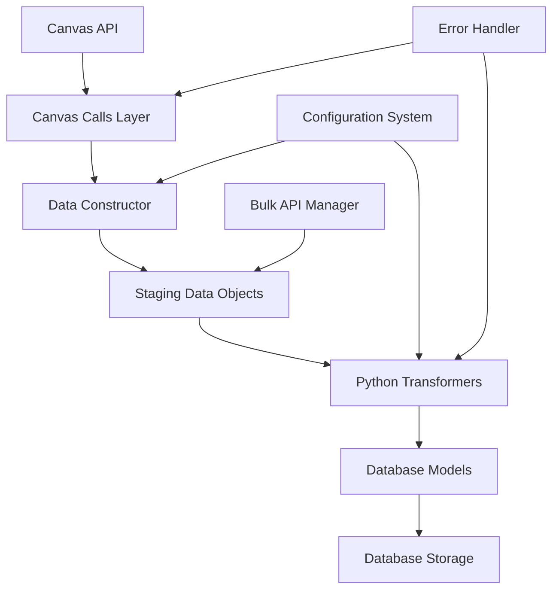

# Canvas Tracker V3: Pipeline Implementation Guide

> **Complete guide for implementing data pipeline orchestration from Canvas API to database storage**

## Overview

This guide demonstrates how to orchestrate the Canvas Tracker V3 data pipeline by examining how our test suite connects the independent modules. The tests reveal the proper way to route data from Canvas API → TypeScript → Transformers → Database.

## Table of Contents

1. [Pipeline Architecture](#pipeline-architecture)
2. [Current Module Status](#current-module-status)
3. [Test-Driven Pipeline Discovery](#test-driven-pipeline-discovery)
4. [Implementation Patterns](#implementation-patterns)
5. [Orchestrator Implementation](#orchestrator-implementation)
6. [Configuration System](#configuration-system)
7. [Error Handling & Monitoring](#error-handling--monitoring)
8. [Example Implementations](#example-implementations)

## Pipeline Architecture

### Data Flow Overview



### Pipeline Stages

| Stage | Technology | Module | Responsibility |
|-------|------------|--------|----------------|
| **API Calls** | TypeScript | `canvas-calls.ts` | Canvas API communication, rate limiting |
| **Data Construction** | TypeScript | `canvas-data-constructor.ts` | API orchestration, data gathering |
| **Data Staging** | TypeScript | `canvas-staging-data.ts` | Clean data structures |
| **Bulk Processing** | TypeScript | `bulk-api-call-staging.ts` | Multi-course orchestration |
| **Data Transformation** | Python | `data_transformers.py` | Format conversion, validation |
| **Database Operations** | Python | `layer1_canvas.py` | Data persistence |

## Current Module Status

### ✅ **Fully Implemented Modules**

1. **Canvas API Layer** (`canvas-interface/core/`)
   - `CanvasCalls` - API communication
   - Rate limiting and error handling
   - Authentication management

2. **Data Construction Layer** (`canvas-interface/staging/`)
   - `CanvasDataConstructor` - API orchestration
   - `CanvasCourseStaging`, `CanvasStudentStaging` - Data models
   - Configuration-driven field filtering

3. **Bulk Processing Layer** (`canvas-interface/staging/`)
   - `CanvasBulkApiDataManager` - Multi-course processing
   - Batch processing with rate limit respect
   - Data reconstruction utilities

4. **Data Transformation Layer** (`database/operations/`)
   - `CanvasDataTransformer` - Format conversion
   - Canvas datetime parsing
   - Data validation and normalization

5. **Database Models** (`database/models/`)
   - Layer 1 Canvas models
   - SQLAlchemy ORM definitions
   - Relationship management

### ❌ **Missing: Pipeline Orchestrator**

**Current Gap**: No centralized orchestrator connects these modules into a cohesive pipeline.

**Evidence**: Tests manually orchestrate the pipeline by calling modules directly in sequence.

## Test-Driven Pipeline Discovery

### Pattern Analysis from Tests

Our tests reveal **three distinct orchestration patterns**:

#### Pattern 1: Single Course Processing
*From `test_real_canvas_api_pipeline.py`*

```python
# 1. Execute Canvas API via TypeScript
canvas_data = self._execute_canvas_typescript(course_id)

# 2. Transform data via Python transformers
registry = get_global_registry()
results = registry.transform_entities(
    canvas_data=canvas_data,
    configuration=config,
    course_id=course_id
)

# 3. Results ready for database storage
```

#### Pattern 2: Bulk Multi-Course Processing  
*From `test_multi_course_canvas_pipeline.py`*

```python
# 1. Execute bulk Canvas API processing
bulk_data = self._execute_bulk_canvas_api(
    max_courses=None, 
    config_name="LIGHTWEIGHT"
)

# 2. Extract transformed data
courses = bulk_data.get('data', {}).get('courses', [])
students = bulk_data.get('data', {}).get('students', [])
assignments = bulk_data.get('data', {}).get('assignments', [])

# 3. Data ready for bulk database operations
```

#### Pattern 3: Configuration-Driven Processing
*From test configurations*

```python
# Configuration controls both API calls and transformations
config = {
    "entities": {
        "courses": True, 
        "students": True, 
        "assignments": False
    },
    "fields": {
        "students": {"scores": True, "analytics": False}
    }
}

# Configuration flows through entire pipeline
```

### Key Insights from Test Analysis

1. **Module Independence**: Each module works independently with clear interfaces
2. **Configuration Propagation**: Configuration flows from orchestrator to all modules
3. **Error Boundaries**: Each stage has independent error handling
4. **Data Format Evolution**: TypeScript → Python → Database requires format conversion
5. **Bulk vs Single**: Different patterns for single vs bulk processing

## Implementation Patterns

### Core Pipeline Interface

Based on test patterns, the orchestrator should implement:

```typescript
interface PipelineOrchestrator {
    // Single course processing
    processCourse(courseId: number, config?: SyncConfiguration): Promise<PipelineResult>;
    
    // Bulk processing
    processBulkCourses(filters?: CourseFilters, config?: SyncConfiguration): Promise<BulkPipelineResult>;
    
    // Configuration management
    validateConfiguration(config: SyncConfiguration): ValidationResult;
    
    // Pipeline monitoring
    getPipelineStatus(): PipelineStatus;
}
```

### Configuration Flow Pattern

```typescript
interface SyncConfiguration {
    entities: {
        courses: boolean;
        students: boolean;
        assignments: boolean;
        enrollments: boolean;
        modules: boolean;
    };
    fields: {
        courses: CourseFieldConfig;
        students: StudentFieldConfig;
    };
    processing: {
        batchSize: number;
        timeout: number;
        retryAttempts: number;
    };
}
```

### Error Handling Pattern

```typescript
interface PipelineResult {
    success: boolean;
    stage: PipelineStage;
    data?: any;
    errors?: PipelineError[];
    metadata: {
        processingTime: number;
        apiCalls: number;
        recordCounts: Record<string, number>;
    };
}
```

## Orchestrator Implementation

### Recommended Architecture

Create a new `PipelineOrchestrator` class that coordinates existing modules:

```
📁 canvas-interface/
├── 📁 orchestration/                 🆕 NEW DIRECTORY
│   ├── pipeline-orchestrator.ts      🆕 Main orchestrator class
│   ├── configuration-manager.ts      🆕 Configuration validation/management
│   └── pipeline-monitor.ts           🆕 Status and monitoring
```

### Implementation Steps

#### Step 1: Create Base Orchestrator

```typescript
// canvas-interface/orchestration/pipeline-orchestrator.ts
import { CanvasDataConstructor } from '../staging/canvas-data-constructor';
import { CanvasBulkApiDataManager } from '../staging/bulk-api-call-staging';
import { SyncConfiguration } from '../types/sync-configuration';

export class PipelineOrchestrator {
    private dataConstructor: CanvasDataConstructor;
    private bulkManager: CanvasBulkApiDataManager;
    private configManager: ConfigurationManager;
    
    constructor(config?: SyncConfiguration) {
        this.configManager = new ConfigurationManager(config);
        this.dataConstructor = new CanvasDataConstructor({
            config: this.configManager.getConfig()
        });
        this.bulkManager = new CanvasBulkApiDataManager(
            this.configManager.getConfig()
        );
    }
    
    async processCourse(courseId: number): Promise<PipelineResult> {
        // Implementation based on test patterns
    }
    
    async processBulkCourses(filters?: CourseFilters): Promise<BulkPipelineResult> {
        // Implementation based on bulk test patterns
    }
}
```

#### Step 2: Implement Single Course Processing

Based on `test_real_canvas_api_pipeline.py` pattern:

```typescript
async processCourse(courseId: number): Promise<PipelineResult> {
    const startTime = Date.now();
    const monitor = new PipelineMonitor();
    
    try {
        // Stage 1: Canvas API Data Collection
        monitor.startStage('canvas_api');
        const stagingData = await this.dataConstructor.constructCourseData(courseId);
        monitor.completeStage('canvas_api', {
            apiCalls: this.dataConstructor.getApiStatus().totalRequests,
            recordCount: 1
        });
        
        // Stage 2: Data Transformation (via subprocess to Python)
        monitor.startStage('transformation');
        const transformedData = await this.executeTransformation(stagingData);
        monitor.completeStage('transformation', {
            recordCount: Object.keys(transformedData).length
        });
        
        // Stage 3: Database Storage (optional - return data for external storage)
        const result = {
            success: true,
            courseId,
            stagingData,
            transformedData,
            metadata: {
                processingTime: Date.now() - startTime,
                stages: monitor.getStageResults(),
                configuration: this.configManager.getConfig()
            }
        };
        
        return result;
        
    } catch (error) {
        return {
            success: false,
            courseId,
            error: error.message,
            stage: monitor.getCurrentStage(),
            metadata: {
                processingTime: Date.now() - startTime,
                stages: monitor.getStageResults()
            }
        };
    }
}
```

#### Step 3: Implement Bulk Processing

Based on `test_multi_course_canvas_pipeline.py` pattern:

```typescript
async processBulkCourses(filters?: CourseFilters): Promise<BulkPipelineResult> {
    const startTime = Date.now();
    
    try {
        // Stage 1: Execute bulk workflow
        const workflowResult = await this.bulkManager.executeBulkWorkflow(
            this.dataConstructor, 
            filters
        );
        
        if (!workflowResult.success) {
            throw new Error(`Bulk workflow failed: ${workflowResult.errors.join(', ')}`);
        }
        
        // Stage 2: Reconstruct all data
        const courses = this.bulkManager.reconstructAllCourses();
        const students = this.bulkManager.reconstructAllStudents();
        const assignments = this.bulkManager.reconstructAllAssignments();
        const enrollments = this.bulkManager.reconstructAllEnrollments();
        
        // Stage 3: Execute transformation (via subprocess to Python)
        const transformationInput = {
            courses,
            students,
            assignments,
            enrollments
        };
        
        const transformedData = await this.executeBulkTransformation(transformationInput);
        
        return {
            success: true,
            workflowResult,
            stagingData: transformationInput,
            transformedData,
            metadata: {
                processingTime: Date.now() - startTime,
                coursesProcessed: workflowResult.coursesProcessed,
                totalApiCalls: workflowResult.totalApiCalls,
                configuration: this.configManager.getConfig()
            }
        };
        
    } catch (error) {
        return {
            success: false,
            error: error.message,
            metadata: {
                processingTime: Date.now() - startTime
            }
        };
    }
}
```

#### Step 4: Python Integration Bridge

The orchestrator needs to bridge to Python transformers. Based on test patterns:

```typescript
private async executeTransformation(stagingData: any): Promise<any> {
    // Create transformation input file
    const inputFile = await this.createTempFile(JSON.stringify({
        course: stagingData,
        // Add other entities as needed
    }));
    
    // Execute Python transformation script
    const pythonScript = path.join(__dirname, '../../database/scripts/transform_data.py');
    const result = await subprocess.run([
        'python', pythonScript,
        '--input', inputFile,
        '--config', JSON.stringify(this.configManager.getConfig())
    ]);
    
    if (result.returncode !== 0) {
        throw new Error(`Transformation failed: ${result.stderr}`);
    }
    
    // Parse transformed results
    const transformedData = JSON.parse(result.stdout);
    await fs.unlink(inputFile); // Cleanup
    
    return transformedData;
}
```

### Configuration System

#### Configuration Manager Implementation

```typescript
// canvas-interface/orchestration/configuration-manager.ts
export class ConfigurationManager {
    private config: SyncConfiguration;
    private validator: ConfigurationValidator;
    
    constructor(config?: SyncConfiguration) {
        this.config = config || FULL_SYNC_PROFILE;
        this.validator = new ConfigurationValidator();
    }
    
    validateConfiguration(): ValidationResult {
        return this.validator.validate(this.config);
    }
    
    getConfig(): SyncConfiguration {
        return { ...this.config };
    }
    
    updateConfig(updates: Partial<SyncConfiguration>): void {
        this.config = { ...this.config, ...updates };
        const validation = this.validateConfiguration();
        if (!validation.valid) {
            throw new Error(`Invalid configuration: ${validation.errors.join(', ')}`);
        }
    }
}
```

### Pipeline Monitoring

```typescript
// canvas-interface/orchestration/pipeline-monitor.ts
export class PipelineMonitor {
    private stages: Map<string, StageResult> = new Map();
    private currentStage?: string;
    
    startStage(stageName: string): void {
        this.currentStage = stageName;
        this.stages.set(stageName, {
            name: stageName,
            startTime: Date.now(),
            status: 'running'
        });
    }
    
    completeStage(stageName: string, metadata?: any): void {
        const stage = this.stages.get(stageName);
        if (stage) {
            stage.endTime = Date.now();
            stage.duration = stage.endTime - stage.startTime;
            stage.status = 'completed';
            stage.metadata = metadata;
        }
        this.currentStage = undefined;
    }
    
    getCurrentStage(): string | undefined {
        return this.currentStage;
    }
    
    getStageResults(): StageResult[] {
        return Array.from(this.stages.values());
    }
}
```

## Configuration System

### Configuration Profiles

Based on test patterns, create predefined configuration profiles:

```typescript
// canvas-interface/types/sync-configuration.ts
export const SYNC_PROFILES = {
    LIGHTWEIGHT: {
        entities: { courses: true, students: true, enrollments: true, assignments: false, modules: false },
        fields: {
            courses: { extended_info: false, public_info: true, settings: false },
            students: { basicInfo: true, scores: true, analytics: false, enrollmentDetails: false }
        },
        processing: { batchSize: 3, timeout: 120000, retryAttempts: 3 }
    },
    
    ANALYTICS_FOCUSED: {
        entities: { courses: true, students: true, enrollments: true, assignments: true, modules: false },
        fields: {
            courses: { extended_info: true, public_info: true, settings: true },
            students: { basicInfo: true, scores: true, analytics: true, enrollmentDetails: true }
        },
        processing: { batchSize: 2, timeout: 180000, retryAttempts: 2 }
    },
    
    FULL_PROCESSING: {
        entities: { courses: true, students: true, enrollments: true, assignments: true, modules: true },
        fields: {
            courses: { extended_info: true, public_info: true, settings: true },
            students: { basicInfo: true, scores: true, analytics: true, enrollmentDetails: true }
        },
        processing: { batchSize: 1, timeout: 300000, retryAttempts: 2 }
    }
} as const;
```

## Error Handling & Monitoring

### Error Classification

```typescript
enum PipelineErrorType {
    CANVAS_API_ERROR = 'canvas_api_error',
    TRANSFORMATION_ERROR = 'transformation_error',
    CONFIGURATION_ERROR = 'configuration_error',
    TIMEOUT_ERROR = 'timeout_error',
    VALIDATION_ERROR = 'validation_error'
}

interface PipelineError {
    type: PipelineErrorType;
    stage: string;
    message: string;
    details?: any;
    recoverable: boolean;
}
```

### Monitoring Integration

```typescript
export class PipelineOrchestrator {
    private metrics: PipelineMetrics = new PipelineMetrics();
    
    async processCourse(courseId: number): Promise<PipelineResult> {
        this.metrics.incrementCounter('courses_processed');
        const timer = this.metrics.startTimer('course_processing_duration');
        
        try {
            // ... processing logic
            this.metrics.incrementCounter('courses_success');
            return result;
        } catch (error) {
            this.metrics.incrementCounter('courses_failed');
            this.metrics.recordError(error);
            throw error;
        } finally {
            timer.end();
        }
    }
}
```

## Example Implementations

### Example 1: Simple Course Processing

```typescript
// Simple orchestrator usage
const orchestrator = new PipelineOrchestrator(SYNC_PROFILES.LIGHTWEIGHT);

const result = await orchestrator.processCourse(7982015);
if (result.success) {
    console.log(`Course processed: ${result.transformedData.courses[0].name}`);
    console.log(`Students: ${result.transformedData.students.length}`);
    
    // Store in database
    await database.storeCourseData(result.transformedData);
} else {
    console.error(`Processing failed: ${result.error}`);
}
```

### Example 2: Bulk Processing with Custom Config

```typescript
// Custom configuration for specific use case
const customConfig = {
    entities: { courses: true, students: true, assignments: false, enrollments: false, modules: false },
    fields: { courses: { extended_info: false, public_info: true, settings: false } },
    processing: { batchSize: 5, timeout: 60000, retryAttempts: 1 }
};

const orchestrator = new PipelineOrchestrator(customConfig);

const filters = {
    workflowStates: ['available'],
    maxCourses: 10
};

const result = await orchestrator.processBulkCourses(filters);
if (result.success) {
    console.log(`Processed ${result.workflowResult.coursesProcessed} courses`);
    console.log(`Total API calls: ${result.metadata.totalApiCalls}`);
    
    // Bulk database operations
    await database.bulkStoreCourseData(result.transformedData);
}
```

### Example 3: Pipeline with Monitoring

```typescript
// Pipeline with comprehensive monitoring
const orchestrator = new PipelineOrchestrator(SYNC_PROFILES.ANALYTICS_FOCUSED);

// Set up monitoring
orchestrator.on('stage_complete', (stage) => {
    console.log(`Stage ${stage.name} completed in ${stage.duration}ms`);
});

orchestrator.on('error', (error) => {
    console.error(`Pipeline error in ${error.stage}: ${error.message}`);
    if (error.recoverable) {
        console.log('Attempting recovery...');
    }
});

// Process with monitoring
const result = await orchestrator.processCourse(7982015);
const status = orchestrator.getPipelineStatus();

console.log(`Success rate: ${status.successRate}%`);
console.log(`Average processing time: ${status.averageProcessingTime}ms`);
```

### Example 4: Integration with Database Layer

```python
# Python integration script: database/scripts/pipeline_integration.py
import json
import sys
from database.operations.transformers import get_global_registry
from database.operations.layer1.canvas_ops import CanvasOperations

def process_pipeline_data(input_data: dict, config: dict) -> dict:
    """Process data from TypeScript pipeline through Python transformers."""
    
    # Transform data using registry
    registry = get_global_registry()
    transformed_data = registry.transform_entities(
        canvas_data=input_data,
        configuration=config,
        course_id=input_data.get('course', {}).get('id')
    )
    
    # Optionally store in database
    if config.get('store_in_database', False):
        canvas_ops = CanvasOperations()
        storage_result = canvas_ops.store_course_data(transformed_data)
        transformed_data['storage_result'] = storage_result
    
    return transformed_data

if __name__ == '__main__':
    # Read input from TypeScript orchestrator
    input_file = sys.argv[1]
    with open(input_file, 'r') as f:
        input_data = json.load(f)
    
    config = json.loads(sys.argv[2]) if len(sys.argv) > 2 else {}
    
    # Process data
    result = process_pipeline_data(input_data, config)
    
    # Return result to TypeScript
    print(json.dumps(result))
```

## Getting Started

### Prerequisites

1. **Existing modules working** - Ensure Canvas API, data construction, and transformers are functional
2. **Test environment** - Use existing test patterns to validate orchestrator
3. **Configuration system** - Start with predefined profiles

### Implementation Steps

1. **Create orchestrator skeleton** using test patterns as reference
2. **Implement single course processing** first (simpler)
3. **Add bulk processing capabilities** using bulk manager
4. **Create Python integration bridge** for transformations
5. **Add monitoring and error handling** incrementally
6. **Test against existing test patterns** to ensure compatibility

### Validation

Use existing test suite to validate orchestrator implementation:

```bash
# Test single course processing
python database/tests/test_real_canvas_api_pipeline.py::TestRealCanvasApiPipeline::test_real_canvas_api_to_transformer_pipeline

# Test bulk processing
python database/tests/test_multi_course_canvas_pipeline.py::TestMultiCourseCanvasPipeline::test_all_available_courses

# Run complete test suite
python database/tests/run_master_test_suite.py
```

---

## Summary

The Canvas Tracker V3 pipeline orchestrator should:

✅ **Coordinate existing modules** without replacing them  
✅ **Follow test-proven patterns** for reliability  
✅ **Support both single and bulk processing** modes  
✅ **Provide comprehensive configuration management**  
✅ **Include monitoring and error handling** capabilities  
✅ **Integrate with both TypeScript and Python** components  

**Next Steps**: Implement the `PipelineOrchestrator` class following the patterns demonstrated in your comprehensive test suite.

---

**Need Help?**

- **Review test patterns** in `database/tests/` for implementation guidance
- **Check existing modules** in `canvas-interface/staging/` for interface contracts
- **Examine configuration system** in `canvas-interface/types/sync-configuration.ts`
- **Test incrementally** using existing test infrastructure